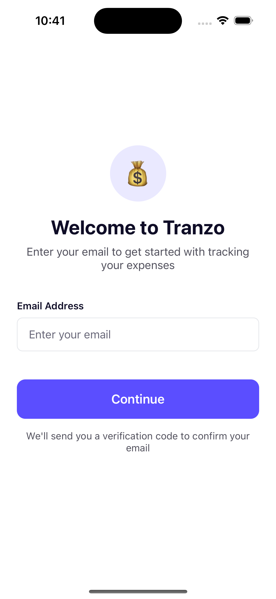
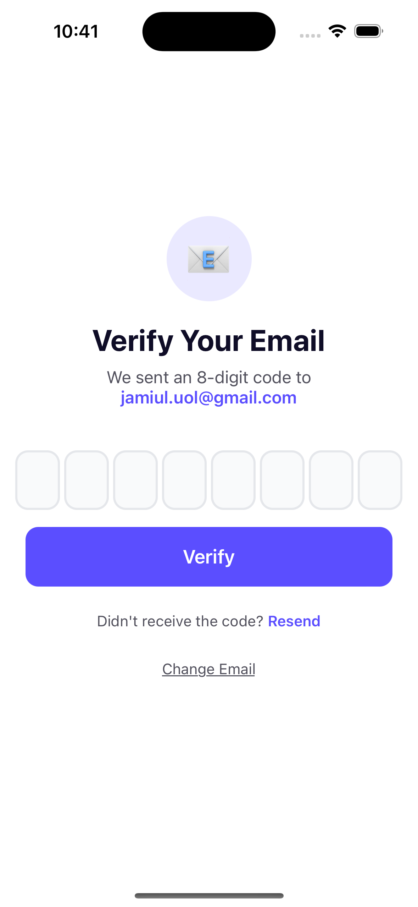
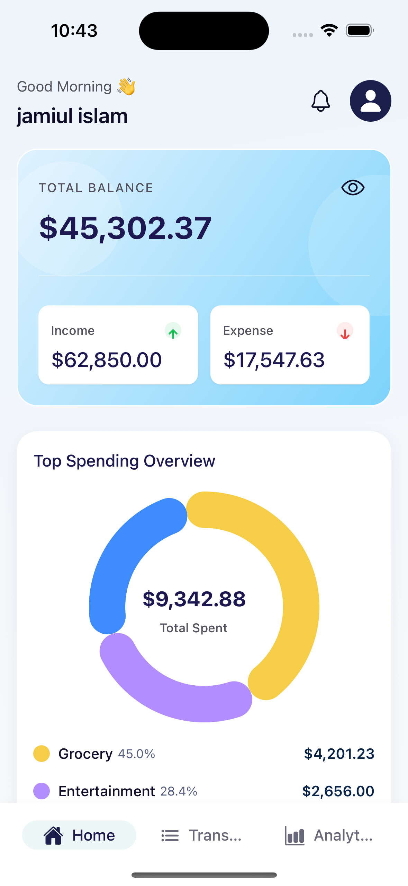
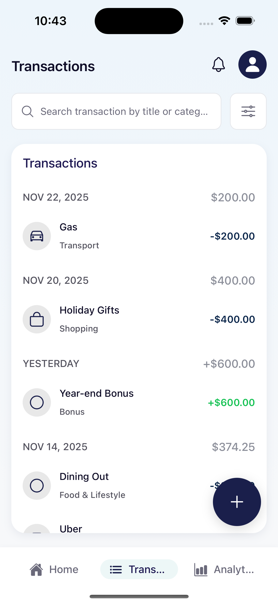
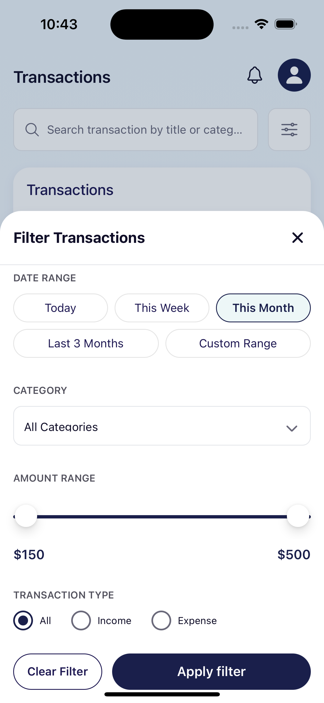
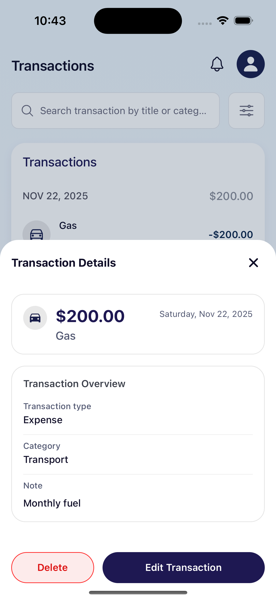
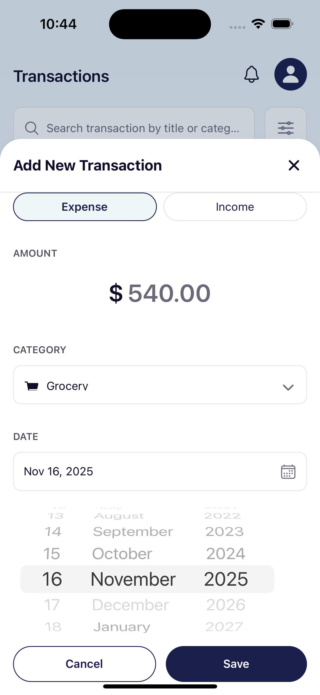
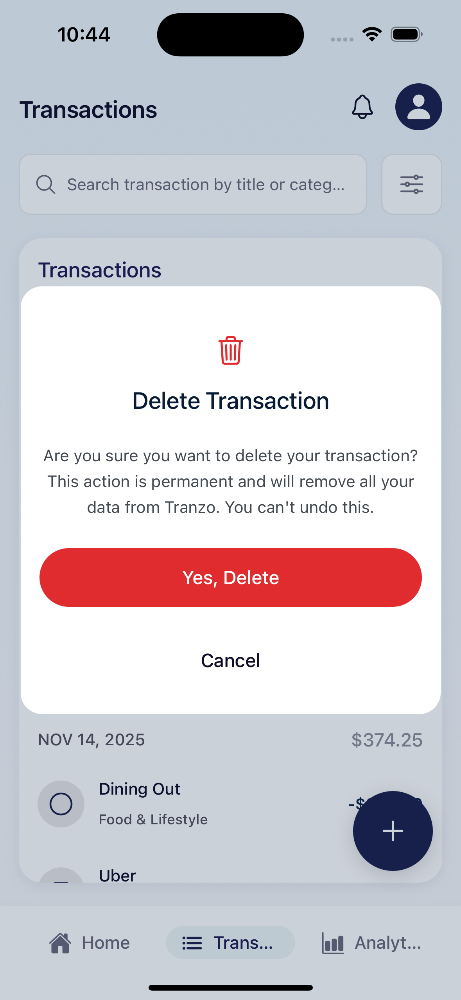
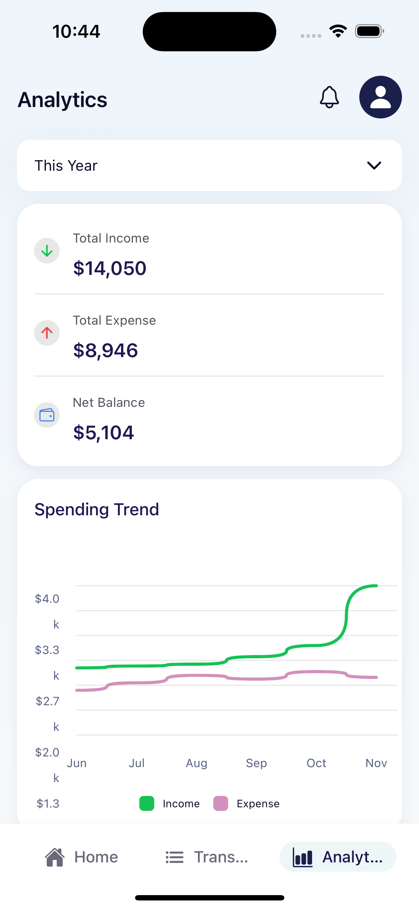
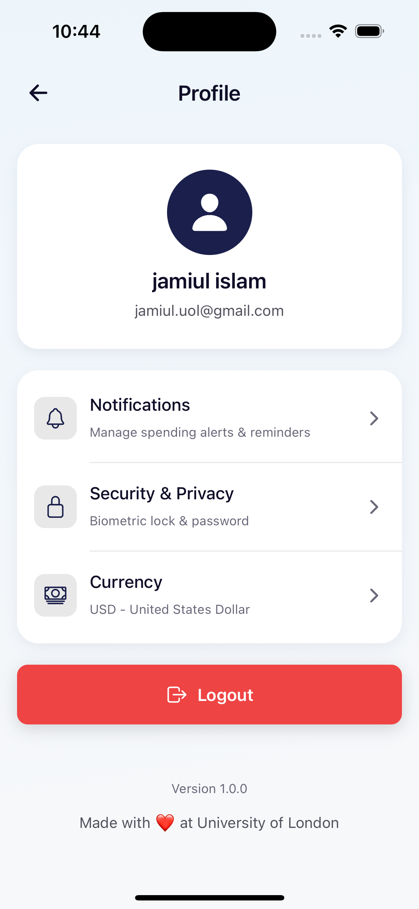

# 💰 TRANZO - Personal Finance Tracker

<div align="center">


**A pixel-perfect, real-time financial dashboard mobile application**

[](https://reactnative.dev/)
[](https://expo.dev/)
[](https://www.typescriptlang.org/)
[](https://supabase.com/)
[](./LICENSE)

[Features](#-features) • [Tech Stack](#-tech-stack) • [Installation](#-installation) • [Usage](#-usage) • [Architecture](#-architecture) • [Contributing](#-contributing)

</div>

---

## 📖 About

**Tranzo** is a modern, feature-rich personal finance tracking application built with React Native and Expo. It provides users with real-time insights into their financial health through intuitive visualizations, comprehensive transaction management, and detailed analytics.

The app follows a pixel-perfect design system inspired by modern fintech applications, with smooth animations, responsive interactions, and a clean, professional aesthetic.

---

## 📱 APP UI

<table>
  <tr>
    <td></td>
    <td></td>
    <td></td>
    <td></td>
    <td></td>
  </tr>
  <tr>
    <td></td>
    <td></td>
    <td></td>
    <td></td>
    <td></td>
  </tr>
</table>

## ✨ Features

### 🏠 Dashboard
- **Real-time Balance Display**: View your total balance with show/hide toggle
- **Income & Expense Summary**: Quick overview cards with current month totals
- **Top Spending Overview**: Donut chart visualization of top 3 spending categories
- **Recent Transactions**: Last 6 transactions with date grouping
- **Pull-to-Refresh**: Real-time data sync from Supabase

### 💳 Transactions Management
- **Complete CRUD Operations**: Add, view, edit, and delete transactions
- **Advanced Search**: Filter transactions by title or category (debounced)
- **Multi-Filter Support**: 
  - Date range (Today, This Week, This Month, This Year)
  - Category selection
  - Amount range
  - Transaction type (Income/Expense)
- **Transaction Details**: Full modal view with all transaction information
- **Floating Action Button**: Quick access to add new transactions

### 📊 Analytics
- **Time Period Filtering**: This Month, Last Month, Last 3 Months, This Year
- **Summary Statistics**: Total income, expenses, and net balance
- **Spending Trend Chart**: 6-month line chart showing income vs expenses
- **Category Breakdown**: Donut chart with spending by category
- **Real-time Updates**: Automatic data refresh based on time range

### 👤 Profile & Settings
- **User Profile**: Display user information with avatar
- **Settings Management**:
  - Notifications (spending alerts & reminders)
  - Security & Privacy (biometric lock & password)
  - Currency (USD display)
- **Logout**: Secure logout with confirmation dialog

### 🔐 Authentication
- **Email/OTP Authentication**: Secure login via Supabase Auth
- **Session Persistence**: Remember user sessions
- **JWT Token Management**: Secure token storage with AsyncStorage

---

## 🛠 Tech Stack

### Core Technologies
- **[React Native](https://reactnative.dev/)** (0.81.5) - Cross-platform mobile framework
- **[Expo](https://expo.dev/)** (54.0.23) - Development platform
- **[TypeScript](https://www.typescriptlang.org/)** (5.9.3) - Type-safe JavaScript
- **[Supabase](https://supabase.com/)** (2.81.1) - Backend as a Service (Database, Auth, Real-time)

### State Management & Navigation
- **[Zustand](https://github.com/pmndrs/zustand)** (5.0.8) - Lightweight state management
- **[React Navigation](https://reactnavigation.org/)** (7.x) - Navigation library
  - Bottom Tabs Navigator
  - Stack Navigator

### UI & Styling
- **[Expo Linear Gradient](https://docs.expo.dev/versions/latest/sdk/linear-gradient/)** - Gradient backgrounds
- **[React Native SVG](https://github.com/react-native-svg/react-native-svg)** (15.12.1) - SVG rendering
- **[Victory Native](https://formidable.com/open-source/victory/docs/native/)** (41.20.2) - Charts and data visualization
- **[Ionicons](https://ionic.io/ionicons)** - Icon library
- **Custom Design System** - Based on Tranzo design specifications

### Development Tools
- **[ESLint](https://eslint.org/)** - Code linting (Airbnb config)
- **[Prettier](https://prettier.io/)** - Code formatting
- **[TypeScript ESLint](https://typescript-eslint.io/)** - TypeScript linting

---

## 📦 Installation

### Prerequisites
- Node.js (v18 or higher)
- Bun (v1.0 or higher) or npm/yarn
- Expo CLI
- iOS Simulator (macOS) or Android Emulator
- Supabase account

### Clone Repository
```bash
git clone https://github.com/jamiul-islam/ai-expense-tracker-mobile-app.git
cd ai-expense-tracker-mobile-app
```

### Install Dependencies
```bash
# Using Bun (recommended)
bun install

# Or using npm
npm install

# Or using yarn
yarn install
```

### Environment Setup

1. Create a `.env.local` file in the root directory:
```env
SUPABASE_URL=your_supabase_project_url
SUPABASE_ANON_KEY=your_supabase_anon_key
EXPO_PUBLIC_SUPABASE_URL=your_supabase_project_url
EXPO_PUBLIC_SUPABASE_KEY=your_supabase_anon_key
EXPO_PUBLIC_SUPABASE_ANON_KEY=your_supabase_anon_key
EXPO_PUBLIC_APP_ENV=development
APP_ENV=development
```

2. Replace the placeholder values with your actual Supabase credentials

### Database Setup

Run the following SQL migrations in your Supabase SQL Editor:

```sql
-- Create users table (extends Supabase auth.users)
CREATE TABLE public.users (
  id UUID REFERENCES auth.users PRIMARY KEY,
  email TEXT UNIQUE NOT NULL,
  full_name TEXT,
  avatar_url TEXT,
  created_at TIMESTAMPTZ DEFAULT NOW(),
  updated_at TIMESTAMPTZ DEFAULT NOW()
);

-- Create transactions table
CREATE TABLE public.transactions (
  id UUID PRIMARY KEY DEFAULT uuid_generate_v4(),
  user_id UUID REFERENCES public.users(id) ON DELETE CASCADE,
  type TEXT CHECK (type IN ('income', 'expense')) NOT NULL,
  amount DECIMAL(10, 2) NOT NULL,
  category TEXT NOT NULL,
  title TEXT NOT NULL,
  note TEXT,
  date DATE NOT NULL DEFAULT CURRENT_DATE,
  status TEXT CHECK (status IN ('completed', 'pending', 'failed')) DEFAULT 'completed',
  created_at TIMESTAMPTZ DEFAULT NOW(),
  updated_at TIMESTAMPTZ DEFAULT NOW()
);

-- Create categories table (optional)
CREATE TABLE public.categories (
  id UUID PRIMARY KEY DEFAULT uuid_generate_v4(),
  name TEXT NOT NULL,
  icon TEXT,
  color TEXT,
  type TEXT CHECK (type IN ('income', 'expense', 'both'))
);

-- Enable Row Level Security
ALTER TABLE public.users ENABLE ROW LEVEL SECURITY;
ALTER TABLE public.transactions ENABLE ROW LEVEL SECURITY;
ALTER TABLE public.categories ENABLE ROW LEVEL SECURITY;

-- Create policies
CREATE POLICY "Users can view own profile"
  ON public.users FOR SELECT
  USING (auth.uid() = id);

CREATE POLICY "Users can update own profile"
  ON public.users FOR UPDATE
  USING (auth.uid() = id);

CREATE POLICY "Users can view own transactions"
  ON public.transactions FOR SELECT
  USING (auth.uid() = user_id);

CREATE POLICY "Users can insert own transactions"
  ON public.transactions FOR INSERT
  WITH CHECK (auth.uid() = user_id);

CREATE POLICY "Users can update own transactions"
  ON public.transactions FOR UPDATE
  USING (auth.uid() = user_id);

CREATE POLICY "Users can delete own transactions"
  ON public.transactions FOR DELETE
  USING (auth.uid() = user_id);

CREATE POLICY "Everyone can view categories"
  ON public.categories FOR SELECT
  TO authenticated
  USING (true);
```

---

## 🚀 Usage

### Start Development Server
```bash
# Using Bun
bun start

# Or using npm
npm start

# Or using yarn
yarn start
```

### Run on iOS Simulator
```bash
bun ios
# or
npm run ios
```

### Run on Android Emulator
```bash
bun android
# or
npm run android
```

### Other Commands
```bash
# Lint code
bun run lint

# Fix linting issues
bun run lint:fix

# Format code
bun run format

# Type check
bun run type-check
```

---

## 📂 Project Structure

```
expense_tracker_app/
├── app.config.js              # Expo configuration
├── app.json                   # App metadata
├── App.tsx                    # Root component
├── babel.config.js            # Babel configuration
├── package.json               # Dependencies
├── tsconfig.json              # TypeScript configuration
├── tailwind.config.js         # Tailwind configuration
│
├── assets/                    # Static assets
│   ├── icons/                 # App icons
│   └── images/                # Images
│
├── docs/                      # Documentation
│   ├── tranzo_design_system_doc.md
│   ├── tranzo_design_system.json
│   ├── tranzo_prds_doc.md
│   ├── tranzo_summary.md
│   └── tranzo_task_tracker.md
│
└── src/
    ├── api/                   # API clients
    │   └── index.ts
    │
    ├── assets/                # App assets
    │   ├── icons/
    │   └── images/
    │
    ├── components/            # Reusable components
    │   ├── index.ts
    │   ├── charts/           # Chart components
    │   │   └── DonutChart.tsx
    │   ├── common/           # Common UI components
    │   │   ├── Button.tsx
    │   │   ├── Card.tsx
    │   │   ├── Icon.tsx
    │   │   ├── Text.tsx
    │   │   └── TextInput.tsx
    │   ├── modals/           # Modal components
    │   │   ├── AddTransactionModal.tsx
    │   │   ├── EditTransactionModal.tsx
    │   │   ├── FilterModal.tsx
    │   │   └── TransactionDetailsModal.tsx
    │   └── sections/         # Section components
    │       ├── BalanceCard.tsx
    │       ├── ScreenHeader.tsx
    │       └── TransactionList.tsx
    │
    ├── constants/            # App constants
    │   └── index.ts
    │
    ├── hooks/                # Custom hooks
    │   └── index.ts
    │
    ├── navigation/           # Navigation setup
    │   ├── AppNavigator.tsx  # Bottom tab navigator
    │   └── RootNavigator.tsx # Stack navigator
    │
    ├── screens/              # Screen components
    │   ├── auth/            # Authentication screens
    │   │   ├── SplashScreen.tsx
    │   │   ├── EmailInputScreen.tsx
    │   │   └── OTPVerificationScreen.tsx
    │   └── app/             # Main app screens
    │       ├── DashboardScreen.tsx
    │       ├── TransactionsScreen.tsx
    │       ├── AnalyticsScreen.tsx
    │       └── ProfileScreen.tsx
    │
    ├── services/            # External services
    │   ├── authService.ts
    │   └── supabase.ts
    │
    ├── store/               # Zustand stores
    │   ├── analyticsStore.ts
    │   ├── transactionStore.ts
    │   ├── uiStore.ts
    │   └── userStore.ts
    │
    ├── theme/               # Design system
    │   ├── animations.ts
    │   ├── colors.ts
    │   ├── index.ts
    │   └── tokens.ts
    │
    ├── types/               # TypeScript types
    │   ├── database.ts
    │   └── index.ts
    │
    └── utils/               # Utility functions
        ├── index.ts
        └── storage.ts
```

---

## 🏗 Architecture

### State Management (Zustand)

**Stores:**
- `userStore` - User authentication and profile
- `transactionStore` - Transaction CRUD operations
- `analyticsStore` - Analytics data and calculations
- `uiStore` - UI state (modals, search, filters)

### Navigation Structure

```
RootNavigator (Stack)
├── Splash Screen
├── Auth Flow
│   ├── Email Input
│   └── OTP Verification
└── App (Bottom Tabs)
    ├── Home/Dashboard
    ├── Transactions
    ├── Analytics
    └── Profile (Stack Screen)
```

### Data Flow

```
User Action → Component
    ↓
Zustand Store Action
    ↓
Supabase API Call
    ↓
Update Zustand State
    ↓
Re-render Components
```

---

## 🎨 Design System

The app follows a comprehensive design system with:
- **Color Palette**: 20+ semantic colors with hex codes
- **Typography**: Inter Display font family with 9 size scales
- **Spacing**: 4px base unit with 7-level scale
- **Shadows**: Figma-extracted shadow specifications
- **Border Radius**: 5 preset sizes (sm, md, lg, pill, full)
- **Animations**: 4 duration presets with easing functions

For detailed design specifications, see [Design System Documentation](./docs/tranzo_design_system_doc.md).

---

## 🔒 Security

- ✅ JWT token-based authentication via Supabase Auth
- ✅ Row Level Security (RLS) on all database tables
- ✅ Secure token storage using AsyncStorage with encryption
- ✅ Input sanitization on all forms
- ✅ No hardcoded credentials (environment variables)
- ✅ HTTPS-only API communication

---

## 📱 Screens

### Authentication
- **Splash Screen**: Initial loading with auto-navigation
- **Email Input**: Email entry for OTP authentication
- **OTP Verification**: 6-digit OTP verification

### Main App
- **Dashboard**: Balance card, summary, top spending, recent transactions
- **Transactions**: Full list with search, filter, CRUD operations
- **Analytics**: Time-based filtering, trend charts, category breakdown
- **Profile**: User info, settings, logout

---

## 🧪 Testing

### Run Tests
```bash
# Run all tests
bun test

# Run tests in watch mode
bun test:watch

# Run tests with coverage
bun test:coverage
```

### Test Checklist
- ✅ Authentication flow works
- ✅ Dashboard displays data correctly
- ✅ Transactions CRUD operations functional
- ✅ Analytics charts render properly
- ✅ Navigation works seamlessly
- ✅ Real-time updates from Supabase
- ✅ Error handling displays appropriate messages
- ✅ Loading states show correctly

---

## 🐛 Troubleshooting

### Common Issues

**Issue: Metro bundler error**
```bash
# Clear cache and restart
bun start --clear
```

**Issue: iOS build fails**
```bash
# Clean iOS build
cd ios && pod install && cd ..
bun ios --clean
```

**Issue: Supabase connection error**
- Verify `.env.local` file exists and has correct credentials
- Check Supabase project URL and anon key
- Ensure network connection is active

**Issue: TypeScript errors**
```bash
# Run type check
bun run type-check
```

---

## 🤝 Contributing

Contributions are welcome! Please follow these steps:

1. Fork the repository
2. Create a feature branch (`git checkout -b feature/amazing-feature`)
3. Commit your changes (`git commit -m 'feat: add amazing feature'`)
4. Push to the branch (`git push origin feature/amazing-feature`)
5. Open a Pull Request

### Commit Convention
```
feat: Add new feature
fix: Fix a bug
docs: Update documentation
style: Format code
refactor: Refactor code
test: Add tests
chore: Update dependencies
```

---

## 📄 License

This project is licensed under the **ISC License**.

---

## 👨‍💻 Author

**Jamiul Islam**
- GitHub: [@jamiul-islam](https://github.com/jamiul-islam)
- Repository: [ai-expense-tracker-mobile-app](https://github.com/jamiul-islam/ai-expense-tracker-mobile-app)

---

## 🙏 Acknowledgments

- Built with ❤️ at **University of London**
- Design inspiration from modern fintech applications
- Icons by [Ionicons](https://ionic.io/ionicons)
- Charts by [Victory Native](https://formidable.com/open-source/victory/)
- Backend by [Supabase](https://supabase.com/)

---

## 📸 Screenshots

> 💡 Add screenshots of your app here to showcase the UI

---

## 🗺 Roadmap

### Upcoming Features
- [ ] Biometric authentication (Face ID/Touch ID)
- [ ] Budget creation and tracking
- [ ] Bill reminders and notifications
- [ ] Export transactions (CSV, PDF)
- [ ] Multiple currency support
- [ ] Dark mode
- [ ] Recurring transactions
- [ ] Receipt scanning with OCR
- [ ] Financial goals and savings targets
- [ ] Multi-account support

---

## 📞 Support

For support, email jamiul.islam@example.com or open an issue on GitHub.

---

<div align="center">

**Made with ❤️ at University of London**

⭐ Star this repo if you found it helpful!

</div>
